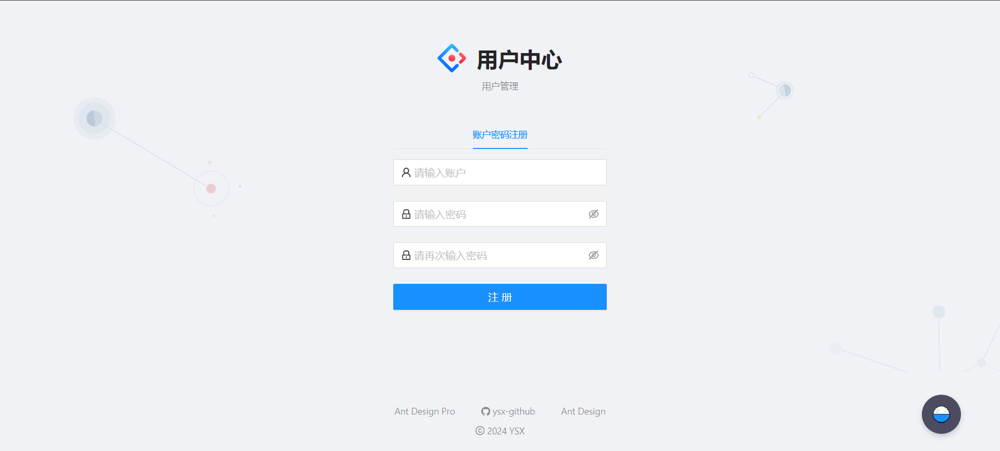

# user-center
## 需求分析
1. 登陆/注册
2. 用户管理（仅管理员可见）对用户的查询或修改
3. 用户校验

## 技术选型

### 前端：

三件套 + React + 组件库 Ant Design + Umi + Ant Design Pro

### 后端：

- java
- spring
- springmvc
- mybatis
- mybatis-plus
- springboot
- junit
- mysql

## 项目地址
前端：http://github.com/ysx-20061105/user-center-frontend

后端：http://github.com/ysx-20061105/user-center-backend

## 展示

